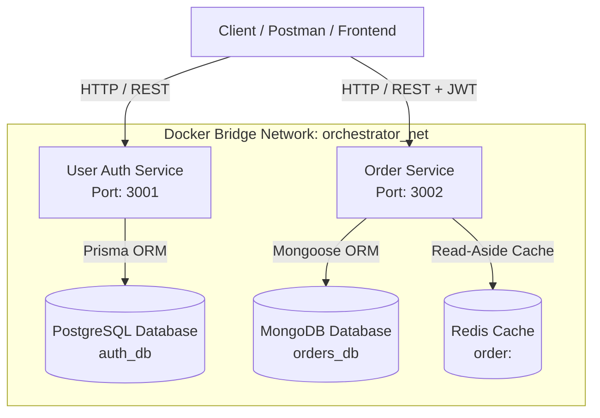

# 🚀 Cloud Order Orchestrator

Production-grade distributed microservices backend architecture built with **Node.js**, **TypeScript**, **Express**, **PostgreSQL**, **MongoDB**, **Redis**, and **Docker**.


---

## 📐 Architecture Overview



---

## 🌟 Key Features & Microservices

### 🔐 `user-auth-service` (Port 3001)
- **Database**: PostgreSQL with **Prisma ORM**.
- **Authentication**: Stateless JWT token issuance & verification.
- **Security**: Password hashing using `bcryptjs` with salt rounds.
- **Access Control**: Role-Based Access Control (RBAC) supporting `USER` and `ADMIN` roles.
- **Validation**: Strict request payload validation using **Zod**.

### 📦 `order-service` (Port 3002)
- **Database**: MongoDB with **Mongoose ORM**.
- **Caching Layer**: High-performance **Redis** Read-Aside caching (`order:<id>`) with automated TTL (5 mins) and cache invalidation.
- **Order Lifecycle**: Full state management (`PENDING` -> `PROCESSING` -> `SHIPPED` -> `DELIVERED` / `CANCELLED`).
- **Authorization**: Inter-service JWT validation & order ownership checks.

---

## 🗄️ Polyglot Persistence Strategy

| Storage | Engine | Justification / Use Case |
| :--- | :--- | :--- |
| **PostgreSQL** | Relational SQL | Strictly consistent, ACID-compliant user credentials, identities, and role mappings. |
| **MongoDB** | NoSQL Document | Flexible schema for complex order items, shipping details, and high-velocity order writes. |
| **Redis** | In-Memory Data Structure Store | Ultra-low latency Read-Aside caching layer for order retrievals and cache invalidation. |

---

## ⚡ Quick Start (Docker Compose)

### Prerequisites
- [Docker Desktop](https://www.docker.com/products/docker-desktop/) installed and running.

### Running the Full Ecosystem
1. **Clone the repository**:
   ```bash
   git clone https://github.com/AngelArteachi/Cloud-order-orchestrator.git
   cd Cloud-order-orchestrator
   ```

2. **Start containers with Docker Compose**:
   ```bash
   docker-compose up --build
   ```
   This will spin up:
   - `orchestrator_postgres` on port `5432`
   - `orchestrator_mongodb` on port `27017`
   - `orchestrator_redis` on port `6379`
   - `orchestrator_user_auth_service` on port `3001`
   - `orchestrator_order_service` on port `3002`

3. **Verify Healthchecks**:
   - Auth Service: `GET http://localhost:3001/health`
   - Order Service: `GET http://localhost:3002/health`

---

## 📚 API Endpoint Reference

### 🔐 Auth Service (`http://localhost:3001`)

| Method | Endpoint | Auth | Description |
| :--- | :--- | :--- | :--- |
| `GET` | `/health` | None | Service health check |
| `POST` | `/api/auth/register` | None | Register new user account |
| `POST` | `/api/auth/login` | None | Authenticate user & return JWT token |
| `GET` | `/api/auth/me` | Bearer JWT | Fetch authenticated user profile |

### 📦 Order Service (`http://localhost:3002`)

| Method | Endpoint | Auth | Description |
| :--- | :--- | :--- | :--- |
| `GET` | `/health` | None | Service health check |
| `POST` | `/api/orders` | Bearer JWT | Create new order (Caches in Redis) |
| `GET` | `/api/orders` | Bearer JWT | Get authenticated user's orders |
| `GET` | `/api/orders/:id` | Bearer JWT | Get order details (Read-Aside cache lookup) |
| `PATCH` | `/api/orders/:id/status` | Admin JWT | Update order status |
| `PATCH` | `/api/orders/:id/cancel` | Bearer JWT | Cancel an order |

---

## 🧪 Automated Testing

The monorepo contains **42 unit and integration test cases** using **Jest** and **Supertest**.

Run tests across all workspaces:
```bash
npm test
```

Run tests for a specific microservice:
```bash
# Auth Service tests
npm --workspace=@cloud-order-orchestrator/user-auth-service test

# Order Service tests
npm --workspace=@cloud-order-orchestrator/order-service test
```

---

## 📁 Repository Structure

```text
.
├── docker-compose.yml
├── package.json
├── tsconfig.json
└── services/
    ├── user-auth-service/
    │   ├── prisma/
    │   │   └── schema.prisma
    │   ├── src/
    │   │   ├── config/
    │   │   ├── controllers/
    │   │   ├── middlewares/
    │   │   ├── repositories/
    │   │   ├── routes/
    │   │   ├── services/
    │   │   └── utils/
    │   └── tests/
    └── order-service/
        ├── src/
        │   ├── config/
        │   ├── controllers/
        │   ├── middlewares/
        │   ├── models/
        │   ├── repositories/
        │   ├── routes/
        │   ├── services/
        │   └── utils/
        └── tests/
```

---

## 📝 License

Distributed under the MIT License.
