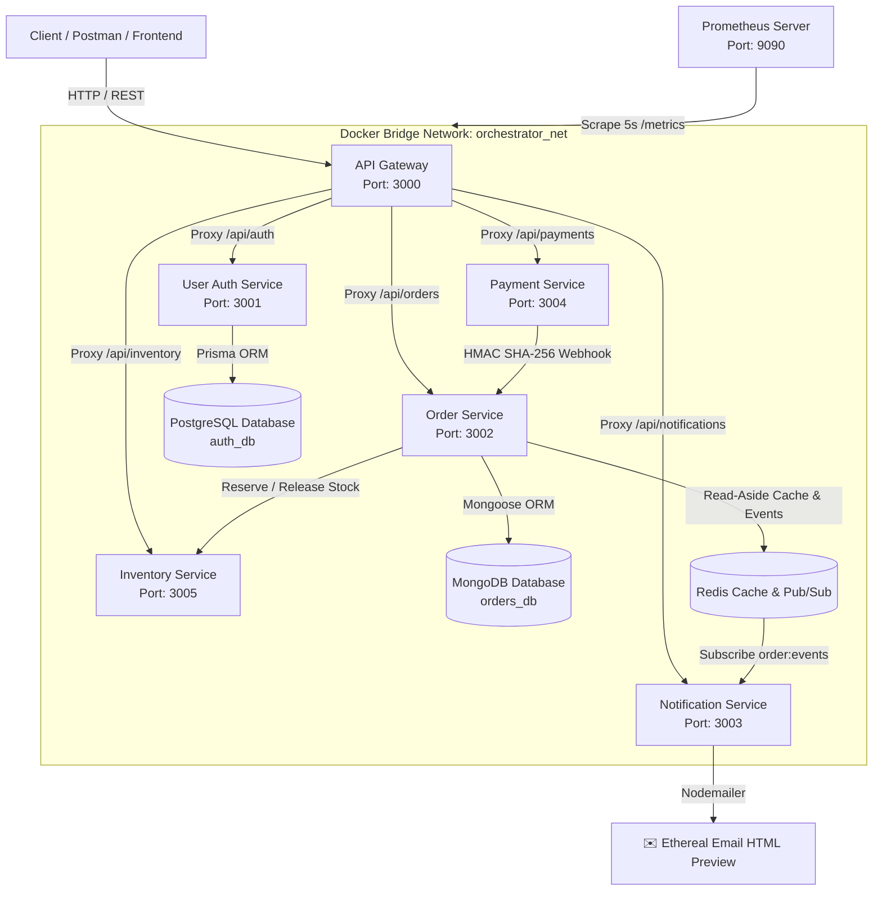

# 🚀 Cloud Order Orchestrator

Production-grade distributed microservices backend architecture built with **Node.js**, **TypeScript**, **Express**, **PostgreSQL**, **MongoDB**, **Redis**, **Prometheus**, and **Docker**.


---

## 📐 Architecture Overview



---

## 🌟 Key Features & Microservices

### 🌐 `api-gateway` (Port 3000)
- **Single Public Entry Point**: Routes `/api/auth`, `/api/orders`, `/api/notifications`, `/api/payments`, `/api/inventory`.
- **Ecosystem Health Dashboard**: `http://localhost:3000/dashboard` interactive live UI.
- **Redis Rate Limiting**: 100 requests per 15 minutes window per IP.
- **Helmet Security**: XSS, Clickjacking, MIME sniffing headers.

### 🔐 `user-auth-service` (Port 3001)
- **Database**: PostgreSQL with **Prisma ORM**.
- **Authentication**: Stateless JWT token issuance & verification.
- **Security**: Password hashing using `bcryptjs`.

### 📦 `order-service` (Port 3002)
- **Database**: MongoDB with **Mongoose ORM**.
- **Caching Layer**: High-performance **Redis** Read-Aside caching (`order:<id>`) with automated TTL (5 mins).
- **Stock Reservation**: Queries `inventory-service` prior to order creation.

### ⚡ `notification-service` (Port 3003)
- **Event-Driven Architecture**: Subscribes to Redis Pub/Sub channel `order:events`.
- **Email Delivery**: Renders responsive HTML email templates delivered to **Ethereal Email** with live preview URLs.

### 💳 `payment-service` (Port 3004)
- **Payment Gateway Simulation**: Processes checkout payments (`POST /api/payments/checkout`).
- **Cryptographic Webhooks**: Signs payloads using HMAC SHA-256 to trigger automated order status transitions (`PENDING` ➔ `PROCESSING`).

### 📦 `inventory-service` (Port 3005)
- **Real-Time Stock Management**: Atomic stock reservation and release.
- **Over-selling Protection**: Rejects order creation if product stock is insufficient.

### 📊 `prometheus` (Port 9090)
- **Observability Stack**: Scrapes `/metrics` endpoints across all 6 microservices every 5 seconds.

---

## ⚡ Quick Start (Docker Compose)

```bash
# 1. Clone repository
git clone https://github.com/AngelArteachi/Cloud-order-orchestrator.git
cd Cloud-order-orchestrator

# 2. Spin up full microservices stack
docker-compose up --build
```

---

## 📚 API Endpoint Reference

All client calls go to **`http://localhost:3000`** (API Gateway):

| Service | Method | Endpoint | Description |
| :--- | :--- | :--- | :--- |
| Gateway | `GET` | `/dashboard` | Interactive Ecosystem Status Dashboard UI |
| Gateway | `GET` | `/api/dashboard` | JSON System Health & Latency metrics |
| Gateway | `GET` | `/health` | API Gateway Health Check |
| Gateway | `GET` | `/metrics` | Prometheus Metrics Endpoint |
| Auth | `POST` | `/api/auth/register` | Register new user account |
| Auth | `POST` | `/api/auth/login` | Login & receive JWT token |
| Auth | `GET` | `/api/auth/me` | Fetch authenticated profile |
| Orders | `POST` | `/api/orders` | Create new order (Checks stock & caches in Redis) |
| Orders | `GET` | `/api/orders` | List user orders |
| Orders | `GET` | `/api/orders/:id` | Fetch order details (Read-Aside cache) |
| Payments | `POST` | `/api/payments/checkout` | Process checkout & dispatch HMAC Webhook |
| Inventory | `GET` | `/api/inventory` | View all product stock levels |
| Inventory | `GET` | `/api/inventory/:productId` | View stock for a specific product |
| Inventory | `POST` | `/api/inventory/reserve` | Reserve stock for items |
| Notifications | `GET` | `/api/notifications` | View notification history & live email preview URLs |

---

## 🧪 Automated Testing

The monorepo contains **62 automated test cases** across 6 microservices:

```bash
npm test
```

---

## 📝 License

Distributed under the MIT License.
